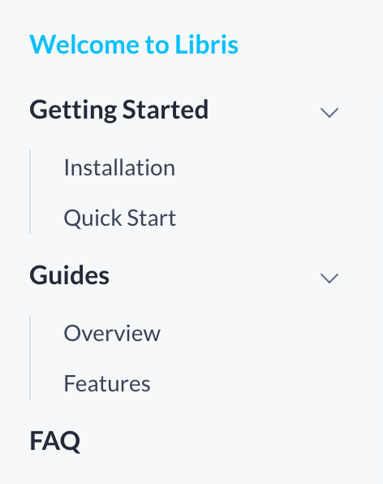

# Libris

A documentation theme for Stackbit.

## Theme Structure

### Folder Structure

All documentation pages must be located inside the `docs` folder. Hierarchically,
there are three type of pages with following naming pattern:

- Documentation root page: `docs/index.md`
- Parent section pages: `docs/<section_name>/index.md`
- Child section pages: `docs/<section_name>/<page_name>.md` 

If a section contains child pages, that section will be rendered with nested
navigation list.

### Navigation

For sections to appear inside navigation menu, they must be defined in
`sections` list inside "Documentation Sections" file `doc_sections.yml` located
inside `data` folder. The order of section in this list will define the
appearance order in navigation menu.  

`doc_sections.yml`:

```yaml
root_folder: /docs/
sections:
  - section_name_1
  - section_name_2
  - section_name_3
```

### Layouts

All page inside `docs` folder should use `docs` layout (`templates/docs.html`).
This layout is responsible for rendering the documentation navigation menu and
uses several properties to control its appearance: 

- `title`: apart from defining the page title, docs layout use this field to
  label navigation menu items.
- `weight`: defines the order of the child section page. This field is ignored
  for parent section pages.
- `excerpt`: Can be defined on a parent section pages to render the description
  of the section in the Overview page (`overview.html`). This field is ignored
  for child section pages. 
 
 
### Example

Here is an example to a folder structure, several documentation pages and
documentation sections:

```
.
├── data
│   ├── doc_sections.yml
│   └── ...
├── content
│   ├── docs
│   │   ├── getting-started
│   │   │   ├── index.md         [section parent page]
│   │   │   ├── installation.md  [section child page]
│   │   │   └── quick-start.md   [section child page]
│   │   ├── guides
│   │   │   ├── index.md         [section parent page]
│   │   │   ├── features.md      [section child page]
│   │   │   └── overview.md      [section child page]
│   │   ├── faq
│   │   │   └── index.md         [section parent page]
│   │   └── index.md             [documentation root page]
│   └── ...
└── ...
```

`content/docs/guides/overview.md`:

    ---
    title: Overview
    weight: 1           # position guides/overview first
    template: docs
    ---
   
`content/docs/guides/features.md`:

    ---
    title: Features
    weight: 2           # position guides/features second
    template: docs
    ---

`data/doc_sections.yml`:

```yaml
root_folder: /docs/
sections:
  - getting-started
  - guides
  - faq
```




### Callouts

To add a callout to your documentation, simply use the following html markup:

```
<div class="important">
  <strong>Important:</strong> 
  This is the "Important" callout block of text. It indicates a warning or caution.
  Use it for an important message. 
</div>
```

```
<div class="note">
  <strong>Note:</strong> 
  This is the "Note" callout block of text. It signifies a general note.
</div>
```

### Syntax Highlighter

To enable syntax highlighting in your code blocks, add a language identifier. For example, to syntax highlight JavaScript code, specify `javascript` next to the tick marks before the fenced code block:

````
```javascript
if (condition) {
  code to run if condition is true
} else {
  run some other code instead
}
```
````

## Main Navigation

The items of the main menu located at the top can be defined either inside the page front matter or inside the `config.yml` file.

To add a page menu item, you should define the `menus` parametter in the front matter of the page. For instance:

    ---
    title: Welcome to Libris
    menus:
      main:
        weight: 2
        title: Docs
    template: docs
    ---

To add a global menu item, you should define it inside the root `menus` field inside `config.yml`. For instance:

    menus:
      main:
        - identifier: github
          title: GitHub
          url: "https://github.com/"
          weight: 6

## Additional Templates

Besides the usual templates (`blog`, `page`, `post`) and documentation templatee mentioned above (`docs`), there are two
additional templates that can be used for pages:

- `overview` - used to list all the documentation sections in a neat grid.
- `showcase` - used to showcase the users of your product.

## Social Links

To display social icons in the footer, update the `social.json` file located in the `data` folder. You can use any icon supported by [Font Awesome](https://fontawesome.com/icons?d=gallery&s=brands) and just need to specify the appropriate Font Awesome class name as the `icon` value.

## Color palettes

Libris supports the following color palettes:

- blue (default)
- green
- navy
- violet

To change the color palette, update the `palette` variable in config.yml.

## Credits

- [Lato](https://fonts.google.com/specimen/Lato). Licensed under the [Open Font License](http://scripts.sil.org/cms/scripts/page.php?site_id=nrsi&id=OFL_web).
- [Font Awesome icons](https://fontawesome.com/). Licensed under the [Font Awesome Free License](https://fontawesome.com/license/free).
- [Unsplash images](https://unsplash.com/). Licensed under the (Unsplash License)[https://unsplash.com/license].
- [Prism syntax highlighter](https://prismjs.com/). Licensed under the (MIT License)[https://opensource.org/licenses/MIT].
- [Reframe.js](https://github.com/dollarshaveclub/reframe.js). Licensed under the (MIT License)[https://opensource.org/licenses/MIT].
- [Smooth Scroll](http://github.com/cferdinandi/smooth-scroll). Licensed under the (MIT License)[https://opensource.org/licenses/MIT].
- [Gumshoe](https://github.com/cferdinandi/gumshoe). Licensed under the (MIT License)[https://opensource.org/licenses/MIT].
- [clipboard.js](https://zenorocha.github.io/clipboard.js). Licensed under the (MIT License)[https://opensource.org/licenses/MIT].
